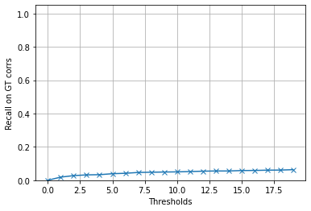

# wxbs_benchmark
> This package implements two evaluation protocols for thw WxBS dataset: PCK for correpondence estimates, and recal on ground truth correspondences given the estimated fundamental matrix


## Install

`pip install wxbs_benchmark`

## How to use

I will show you how to benchmark a simple baseline of OpenCV SIFT + MAGSAC++ below.

```python
import numpy as np
import cv2
import kornia.feature as KF
import torch
from kornia_moons.feature import *
from tqdm import tqdm
from wxbs_benchmark.dataset import *
from wxbs_benchmark.evaluation import *
import matplotlib.pyplot as plt


def estimate_F_SIFT(img1, img2):
    det = cv2.SIFT_create(8000, contrastThreshold=-10000, edgeThreshold=10000)
    kps1, descs1 = det.detectAndCompute(img1, None)
    kps2, descs2 = det.detectAndCompute(img2, None)
    snn_ratio, idxs = KF.match_snn(torch.from_numpy(descs1),
                           torch.from_numpy(descs2), 0.9)
    tentatives = cv2_matches_from_kornia(snn_ratio, idxs)
    src_pts = np.float32([ kps1[m.queryIdx].pt for m in tentatives ]).reshape(-1,2)
    dst_pts = np.float32([ kps2[m.trainIdx].pt for m in tentatives ]).reshape(-1,2)
    F, _ = cv2.findFundamentalMat(src_pts, dst_pts, cv2.USAC_MAGSAC, 0.25, 0.999, 100000)
    return F

def estimate_F_SIFT_HardNet(img1, img2):
    det = cv2.SIFT_create(8000, contrastThreshold=-10000, edgeThreshold=10000)
    kps1, descs1 = det.detectAndCompute(img1, None)
    kps2, descs2 = det.detectAndCompute(img2, None)
    snn_ratio, idxs = KF.match_snn(torch.from_numpy(descs1),
                           torch.from_numpy(descs2), 0.9)
    tentatives = cv2_matches_from_kornia(snn_ratio, idxs)
    src_pts = np.float32([ kps1[m.queryIdx].pt for m in tentatives ]).reshape(-1,2)
    dst_pts = np.float32([ kps2[m.trainIdx].pt for m in tentatives ]).reshape(-1,2)
    F, _ = cv2.findFundamentalMat(src_pts, dst_pts, cv2.USAC_MAGSAC, 0.25, 0.999, 100000)
    return F


Fs = []
subset = 'test'
dset = WxBSDataset('.WxBS', subset=subset, download=True)
for pair_dict in tqdm(dset):
    Fs.append(estimate_F_SIFT(pair_dict['img1'],
                         pair_dict['img2']))
result_dict, thresholds = evaluate_Fs(Fs, subset)

```

    /opt/homebrew/Caskroom/miniforge/base/envs/python39/lib/python3.9/site-packages/ipykernel/ipkernel.py:283: DeprecationWarning: `should_run_async` will not call `transform_cell` automatically in the future. Please pass the result to `transformed_cell` argument and any exception that happen during thetransform in `preprocessing_exc_tuple` in IPython 7.17 and above.
      and should_run_async(code)
    100%|██████████| 32/32 [00:12<00:00,  2.65it/s]





```python

plt.figure()
plt.plot(thresholds, result_dict['average'], '-x')
plt.ylim([0,1.05])
plt.xlabel('Thresholds')
plt.ylabel('Recall on GT corrs')
plt.grid(True)
plt.legend(['SIFT + MAGSAC++'])

```

    /opt/homebrew/Caskroom/miniforge/base/envs/python39/lib/python3.9/site-packages/ipykernel/ipkernel.py:283: DeprecationWarning: `should_run_async` will not call `transform_cell` automatically in the future. Please pass the result to `transformed_cell` argument and any exception that happen during thetransform in `preprocessing_exc_tuple` in IPython 7.17 and above.
      and should_run_async(code)


    <matplotlib.legend.Legend at 0x16e382b50>


We can also check per-image-pair results

```python
plt.figure(figsize=(10,10))
plt.ylim([0,1.05])
plt.xlabel('Thresholds')
plt.ylabel('Recall on GT corrs')
plt.grid(True)


for img_pair, recall in result_dict.items():
    plt.plot(thresholds, recall, '-x', label=img_pair)

plt.legend()

```

    /opt/homebrew/Caskroom/miniforge/base/envs/python39/lib/python3.9/site-packages/ipykernel/ipkernel.py:283: DeprecationWarning: `should_run_async` will not call `transform_cell` automatically in the future. Please pass the result to `transformed_cell` argument and any exception that happen during thetransform in `preprocessing_exc_tuple` in IPython 7.17 and above.
      and should_run_async(code)


    <matplotlib.legend.Legend at 0x173e39820>


